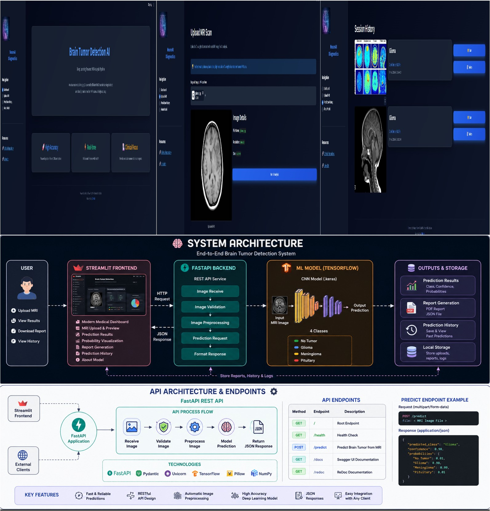

<p align="center">
  
</p>

---

# 🧠 Brain Tumor Detection using Deep Learning

> **An end-to-end AI-powered Brain Tumor Detection System built with TensorFlow, FastAPI, Streamlit, and Docker.**

<p align="left">     </p>

This project uses a Convolutional Neural Network (CNN) to classify brain MRI scans into four categories:

* 🟢 No Tumor
* 🔵 Glioma
* 🟡 Meningioma
* 🔴 Pituitary

The application provides a modern medical dashboard where users can upload MRI scans, receive AI-powered predictions, visualize confidence scores, generate downloadable reports, and review previous prediction history.

---

## 📂 Classes

| Index | Class      |
| ----- | ---------- |
| 0     | Glioma     |
| 1     | Meningioma |
| 2     | No Tumor   |
| 3     | Pituitary  |

---

# 🚀 Features

### 🤖 AI-Based Brain Tumor Classification

* Deep Learning model trained using TensorFlow/Keras.
* Predicts one of four MRI classes.
* Returns prediction confidence and class probabilities.

### 🏥 Modern Medical Dashboard

* Premium dark-themed Streamlit interface.
* Clean and responsive layout.
* Glassmorphism-inspired UI.

### 📤 MRI Image Upload

* Upload JPG, JPEG, and PNG MRI scans.
* Image preview before prediction.
* Automatic image information extraction.

### 📊 Prediction Results

Displays:

* Predicted tumor class
* Confidence score
* Probability distribution
* MRI image information

### 📄 Report Generation

Download prediction results as:

* PDF Report
* JSON File
* Prediction Summary

### 📚 Prediction History

* Stores previous predictions persistently.
* Star ⭐ and delete 🗑️ individual entries.
* Survives server restarts.

### ⚡ FastAPI Backend

* REST API for model inference.
* Swagger documentation.
* Modular API structure.

### 🐳 Docker Support

* Dockerized application.
* Easy deployment.
* Reproducible environment.

---

## 🔌 API Endpoint

```
POST /predict
```

**Input:**

- MRI Image (multipart/form-data)

**Output:**

```json
{
    "predicted_class": "glioma",
    "confidence": 95.93,
    "probabilities": {
        "glioma": 95.93,
        "meningioma": 1.56,
        "notumor": 2.29,
        "pituitary": 0.22
    }
}
```

Swagger UI available at: `http://127.0.0.1:8000/docs`

---

## 🧬 Model

| Property     | Value                              |
| ------------ | ---------------------------------- |
| Architecture | EfficientNetB0 (Transfer Learning) |
| Framework    | TensorFlow / Keras                 |
| Input Size   | 224 × 224 RGB                     |
| Output       | 4 Brain Tumor Classes              |
| Saved Model  | `models/best_model.keras`        |

---

# 🛠 Tech Stack

## Artificial Intelligence

* Python
* TensorFlow
* Keras
* NumPy

## Backend

* FastAPI
* Uvicorn
* Pydantic

## Frontend

* Streamlit
* HTML
* CSS

## Deployment

* Docker
* Docker Compose

## Other Libraries

* Pillow
* Requests
* fpdf2

---

# 📁 Project Structure

```text
brain-tumor-detector/

app/
│
├── api/
│
├── frontend/
│
├── inference/
│
└── utils/

models/

data/

docs/

reports/

tests/

uploads/

Dockerfile

docker-compose.yml

requirements.txt

README.md
```

---

# ⚙️ Architecture Diagram

```text
MRI Scan
    │
    ▼
Streamlit Dashboard
    │
HTTP POST
    │
    ▼
FastAPI
    │
    ▼
Preprocessing
    │
    ▼
CNN Model (EfficientNetB0)
    │
    ▼
Prediction
    │
    ▼
Probability Scores
    │
    ▼
PDF Report
```

---

# 💻 Installation

## Clone Repository

```bash
git clone https://github.com/<user name .brain-tumor-detector.git
cd brain-tumor-detector
```

## Create Virtual Environment

```bash
python -m venv venv
```

Windows

```bash
venv\Scripts\activate
```

Linux / macOS

```bash
source venv/bin/activate
```

## Install Dependencies

```bash
pip install -r requirements.txt
```

---

# ▶️ Run FastAPI

```bash
uvicorn app.api.main:app --reload --port 8000
```

API:

```
http://127.0.0.1:8000
```

Swagger:

```
http://127.0.0.1:8000/docs
```

---

# ▶️ Run Streamlit

```bash
streamlit run app/frontend/streamlit_app.py
```

Application:

```
http://localhost:8501
```

---

# 🐳 Docker

Build Image

```bash
docker build -t brain-tumor-detector .
```

Run Container

```bash
docker run -p 8501:8501 brain-tumor-detector
```

---

# 📷 Application Screenshots

all these images in website.....

* Dashboard
* MRI Upload
* Prediction Result
* Probability Distribution
* Report Download
* Prediction History
* About Model

---

# 🔮 Future Improvements

### 🏥 Medical

* Grad-CAM visualization
* Explainable AI (XAI)

### 🔧 Backend

* JWT Authentication
* PostgreSQL database integration

### ☁️ Deployment

* AWS
* Azure
* GCP

### 🤖 MLOps

* MLflow experiment tracking
* DVC for data versioning
* CI/CD pipeline
* Monitoring and logging

---

# 👨‍💻 Author

    **Sai**

    ML and DL Project.

---

# 📄 License

This project is released under the MIT License.
